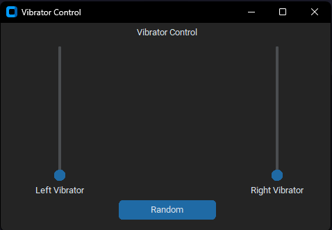

# BLXinput

Bluetooth xbox vibrator controller

## Description

Simple python script to control the vibration of an xbox controller connected via usb or bluetooth, it uses the XInput library to communicate with the controller. It can be used for anything that requires a vibration feedback, like games, notifications, etc. ( ͡° ͜ʖ ͡°)

## Installation

Simply clone the repository and install the required dependencies with pip:

`pip install -r requirements.txt`
